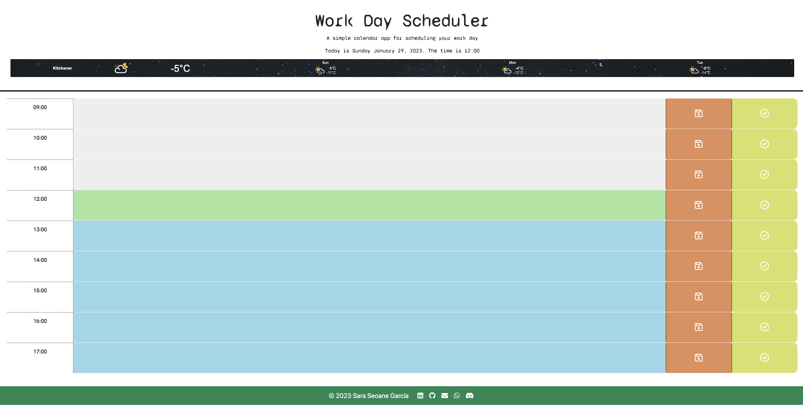
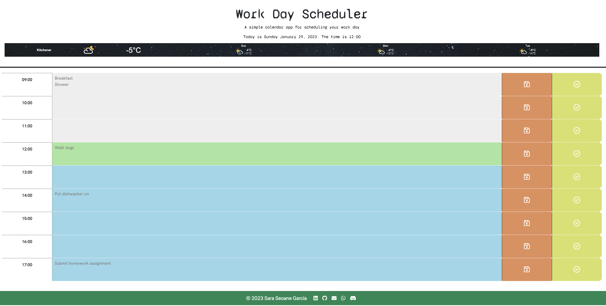
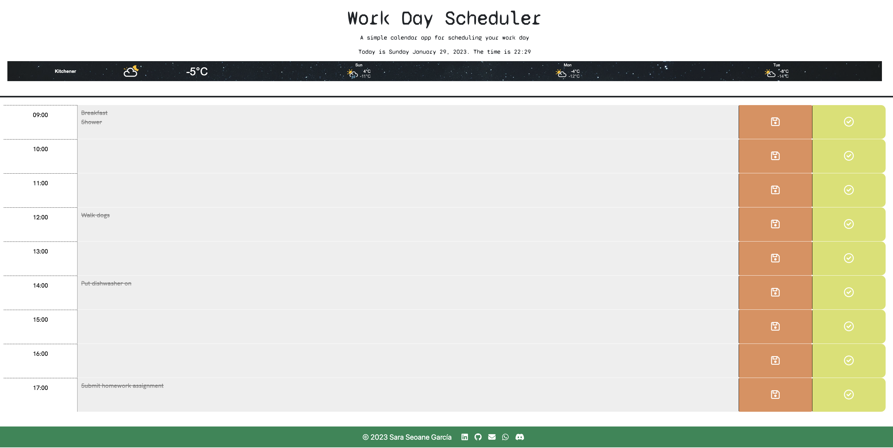

# Work Day Scheduler

## Description

I have created a simple planner application that allows the user to save events for each hour of the day.

The current day and time are displayed at the top of the planner. The planner has blocks for each hour from 9 to 5 pm (standard business hours). The user can view the time blocks for the current day and each block is color-coded to indicate whether it's in the past, present or future.

The user can click on a time block and enter some text to create an event then press the save button. If the user refreshes the page, the event is still displayed.

## Screenshots

### Empty scheduler

Time is 12 o'clock, any hour slots before this time will be grey, current slot is red and future slots will be green.

### Filled in scheduler

### Completed items

### End of day scheduler

All hour slots are now grey because the time is after 5 pm. The user has also crossed out completed items

## Deployment

<https://sarasg89.github.io/Work-Day-Scheduler/>

## Credits

The starter code for this application can be found in [this repository](https://github.com/coding-boot-camp/crispy-octo-meme) by Georgeyoo.

The weather widget is provide by [Weatherwidget.org](https://weatherwidget.org/).

## License

MIT License

Copyright (c) 2023 sarasg89

Permission is hereby granted, free of charge, to any person obtaining a copy of this software and associated documentation files (the "Software"), to deal in the Software without restriction, including without limitation the rights to use, copy, modify, merge, publish, distribute, sublicense, and/or sell copies of the Software, and to permit persons to whom the Software is furnished to do so, subject to the following conditions:

The above copyright notice and this permission notice shall be included in all copies or substantial portions of the Software.

THE SOFTWARE IS PROVIDED "AS IS", WITHOUT WARRANTY OF ANY KIND, EXPRESS OR IMPLIED, INCLUDING BUT NOT LIMITED TO THE WARRANTIES OF MERCHANTABILITY, FITNESS FOR A PARTICULAR PURPOSE AND NONINFRINGEMENT. IN NO EVENT SHALL THE AUTHORS OR COPYRIGHT HOLDERS BE LIABLE FOR ANY CLAIM, DAMAGES OR OTHER LIABILITY, WHETHER IN AN ACTION OF CONTRACT, TORT OR OTHERWISE, ARISING FROM, OUT OF OR IN CONNECTION WITH THE SOFTWARE OR THE USE OR OTHER DEALINGS IN THE SOFTWARE.
